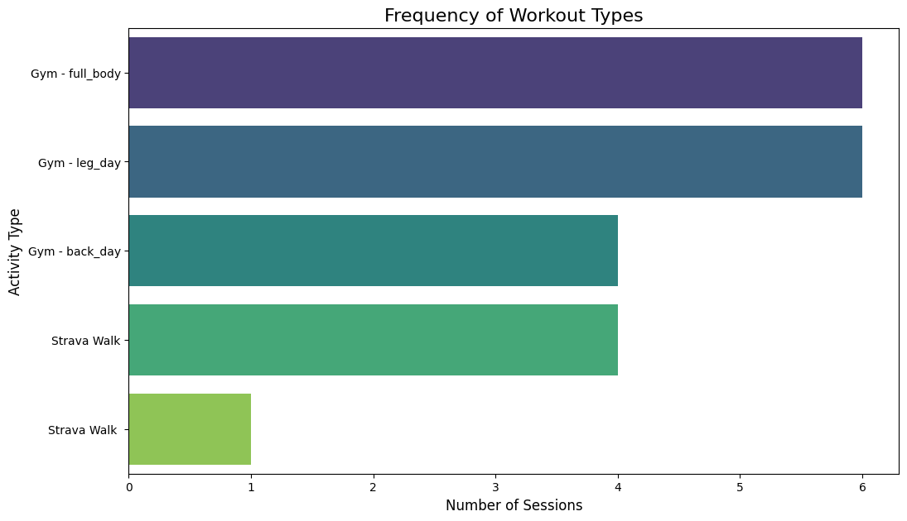

# Personal Fitness Analytics: A "Data of Me" Project

## 📋 Project Overview

This project is a deep dive into my personal fitness routine, born from a desire to apply data analytics to my passion for health and wellness. Faced with the common problem of not having a smartwatch to automatically track workouts, I took a hands-on approach: I designed and implemented my own data collection system.

This "hybrid" system combines automated exports from my weekly Strava walks with a manually maintained log of my gym sessions in Google Sheets. The result is a unique and rich dataset that serves as the foundation for this analysis.

The goal was to move beyond simple tracking and uncover actionable insights about my consistency, the link between effort and mood, and the overall structure of my fitness plan.

---

## ❓ Key Questions

This analysis sought to answer three main questions:
1.  **Consistency:** How consistent is my workout routine over a multi-month period?
2.  **Wellbeing:** Is there a tangible relationship between the perceived exertion of a workout and my mood afterward?
3.  **Strategy:** What is the actual breakdown of my activities, and how balanced is my routine?

---

## 🛠️ Tools & Libraries

* **Data Collection:** Google Sheets, Strava Data Export
* **Analysis:** Python, Pandas
* **Visualization:** Matplotlib, Seaborn, Calplot
* **Environment:** Jupyter Notebook

---

## 📊 Analysis & Findings

### 1. Workout Consistency Heatmap
This calendar heatmap provides a bird's-eye view of my active days (gym or walk) versus rest days. The consistent pattern of colored squares demonstrates a strong and sustained commitment to my fitness schedule.

### 2. Effort vs. Reward Scatterplot
This plot explores the relationship between how difficult a workout felt and how I felt afterward. The key insight is that **any level of physical activity consistently boosted my mood to a 5/5**. This provides a powerful, data-driven motivation to stay active.

### 3. Activity Breakdown Bar Chart
This chart quantifies my workout routine, showing a balanced distribution between different strength training days (leg, back, full body) and cardiovascular exercise (Strava walks).

---

## 🎯 Conclusion

This project was a fantastic exercise in end-to-end data analysis. It proved that you don't need expensive gadgets to generate meaningful data—just a clear goal and a systematic approach. The findings have reinforced the positive impact of my routine on my well-being and provided a clear picture of my balanced fitness strategy.
